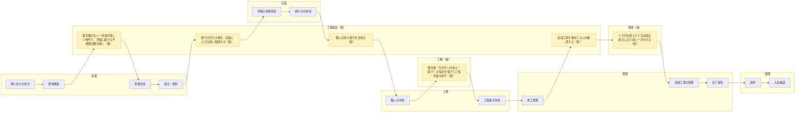

# 業務フロー 改善前と改善後（仮）

黄色の点線＝「仮」で追加した行（次のヒアリングで確かめる）。

## 改善前（公式）

```mermaid
flowchart LR
  subgraph L0["営業"]
    direction TB
    T0["問い合わせ受付"]
    T1["現地調査"]
    T2["見積作成"]
    T3["受注・契約"]
  end
  subgraph L1["店長"]
    direction TB
    T4["見積の最終承認"]
    T5["値引きの承認"]
  end
  subgraph L2["工務"]
    direction TB
    T6["職人の手配"]
    T7["工程表の作成"]
  end
  subgraph L3["現場"]
    direction TB
    T8["施工管理"]
    T9["追加工事の見積"]
    T10["完了報告"]
  end
  subgraph L4["経理"]
    direction TB
    T11["請求"]
    T12["入金確認"]
  end
  T0 --> T1
  T1 --> T2
  T2 --> T3
  T3 --> T4
  T4 --> T5
  T5 --> T6
  T6 --> T7
  T7 --> T8
  T8 --> T9
  T9 --> T10
  T10 --> T11
  T11 --> T12
  classDef prov fill:#fff3c4,stroke:#c98a00,stroke-dasharray: 5 3,color:#5a3d00
  classDef added fill:#ffe0d6,stroke:#c0392b,color:#5a1a10
```

## 改善後（仮・人の承認待ち）

```mermaid
flowchart LR
  subgraph L0["営業"]
    direction TB
    T0["問い合わせ受付"]
    T1["現地調査"]
    T3["見積作成"]
    T4["受注・契約"]
  end
  subgraph L1["工事統括（仮）"]
    direction TB
    T2["築年数が古い・状態が怪しい物件で、見積に載せる予備費の額を聞く（仮）"]
    T5["値引きが入る場合、店長に上げる前に相談する（仮）"]
    T8["職人の割り振りを決める（仮）"]
    T13["追加工事を進めてよいか確認する（仮）"]
  end
  subgraph L2["店長"]
    direction TB
    T6["見積の最終承認"]
    T7["値引きの承認"]
  end
  subgraph L3["工務"]
    direction TB
    T9["職人の手配"]
    T11["工程表の作成"]
  end
  subgraph L4["工務（仮）"]
    direction TB
    T10["優先客（付き合いのある・紹介）の指示を受けて工程を組み直す（仮）"]
  end
  subgraph L5["現場"]
    direction TB
    T12["施工管理"]
    T15["追加工事の見積"]
    T16["完了報告"]
  end
  subgraph L6["現場（仮）"]
    direction TB
    T14["十万円を超えそうな追加は施主に言う前に一声かける（仮）"]
  end
  subgraph L7["経理"]
    direction TB
    T17["請求"]
    T18["入金確認"]
  end
  T0 --> T1
  T1 --> T2
  T2 --> T3
  T3 --> T4
  T4 --> T5
  T5 --> T6
  T6 --> T7
  T7 --> T8
  T8 --> T9
  T9 --> T10
  T10 --> T11
  T11 --> T12
  T12 --> T13
  T13 --> T14
  T14 --> T15
  T15 --> T16
  T16 --> T17
  T17 --> T18
  classDef prov fill:#fff3c4,stroke:#c98a00,stroke-dasharray: 5 3,color:#5a3d00
  classDef added fill:#ffe0d6,stroke:#c0392b,color:#5a1a10
  class T2 prov
  class T5 prov
  class T8 prov
  class T10 prov
  class T13 prov
  class T14 prov
```
